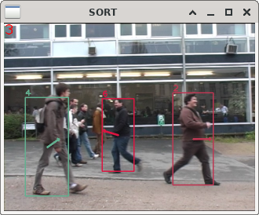
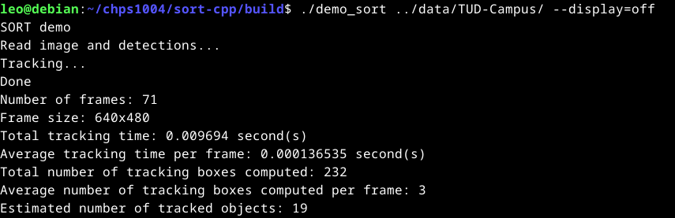

# À propos de ce projet

Ce projet de détection et de suivi d'objet en temps réel a été réalisé par Léo Goire, étudiant en deuxième année de Master Calcul Haute Performance et Simulation à l'université de Reims, dans le cadre du module CHPS1004 dédié à la réalisation d'un projet de recherche.

Le code présenté dans ce dépôt est tiré du programme `sort-cpp` développé par `itsuki2021` et disponible à l'adresse suivante : `https://github.com/itsuki2021/sort-cpp`

# Installations

## Dépendances

```
sudo apt update
sudo apt install -y git                 # Pour le clonage du projet
sudo apt install -y gcc g++ cmake make  # Pour la compilation d'OpenCV et du programme
sudo apt install -y libgtk2.0-dev       # Pour le support graphique du programme
```

## OpenCV

Pour installer OpenCV vous pouvez suivre le guide officiel disponible à l'adresse ci-dessous :

`https://docs.opencv.org/4.x/d7/d9f/tutorial_linux_install.html`

Au moment de générer les scripts de compilation, utilisez la commande suivante afin de lier la compilation d'OpenCV à GTK pour pouvoir utiliser la version graphique du programme :

```
cmake -D CMAKE_BUILD_TYPE=RELEASE -D CMAKE_INSTALL_PREFIX=/usr/local -D WITH_TBB=ON -D BUILD_NEW_PYTHON_SUPPORT=ON -D WITH_V4L=ON -D INSTALL_C_EXAMPLES=ON -D INSTALL_PYTHON_EXAMPLES=ON -D BUILD_EXAMPLES=ON -D WITH_QT=ON -D WITH_GTK=ON -D WITH_OPENGL=ON ..
```

## Clonage du projet

```
git clone https://github.com/Cryptossss/CHPS1004_Projet_M2
```

# Structure du projet

```
.
├── build                           # Répertoire de compilation et d'exécution
│   └── ...
│
├── data                            # Répertoire contenant les jeux de données de test
│   ├── ADL-Rundle-6
│   │   ├── det
│   │   |   └── det.txt             # Fichier contenant la matrice de détection initiale du jeu de données
│   │   ├── gt
│   │   |   └── gt.txt
│   │   ├── img1                    # Répertoire contenant la séquence d'images du jeu de données
│   │   |   ├── 000001.jpg
│   │   |   ├── 000002.jpg
│   │   |   ├── 000003.jpg
│   │   |   └── ...
│   │   └── seqinfo.ini             # Fichier de configuration contenant les informations sur le jeu de données
│   └── ...
│
├── include                         # Répertoire des fichiers d'entête, contient les déclarations des fonctions
│   ├── kalman_box_tracker.h
│   ├── kuhn_munkres.h
│   └── sort.h
│
├── src                             # Répertoire des fichiers sources, contient les définitions des fonctions
│   ├── kalman_box_tracker.cpp
│   ├── kuhn_munkres.cpp
│   └── sort.cpp
│
├── CMakeList.txt                   # Fichier CMake de compilation
├── LICENCE                         # Informations sur la licence du programme
├── README.md                       # Informations sur le projet
└── main.cpp                        # Programme principal
```

# Compilation

```
mkdir build && cd build
cmake ..
make -j
```

# Exécution

```
# Exécution du programme en mode graphique avec le jeu de données TUD-Campus :
./demo_sort ../data/TUD-Campus/ --display=on
```



```
# Exécution du programme en mode terminal avec le jeu de données TUD-Campus :
./demo_sort ../data/TUD-Campus/ --display=off
```

